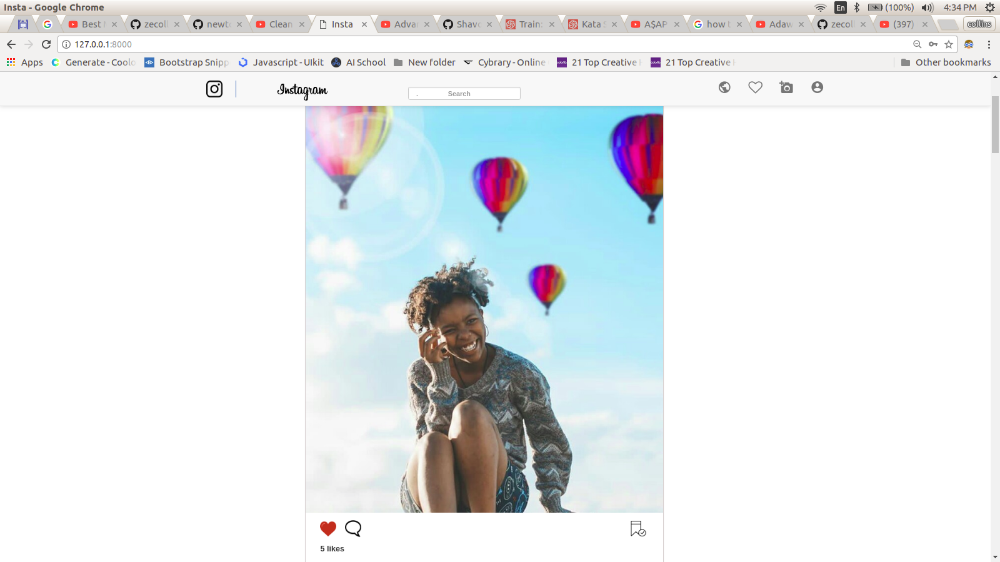
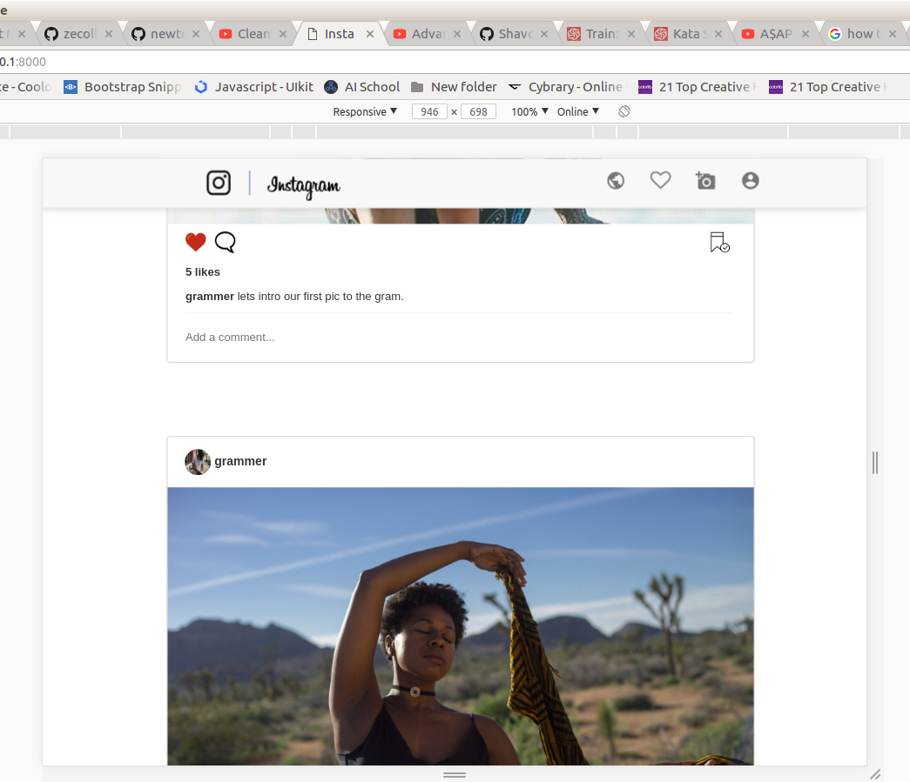
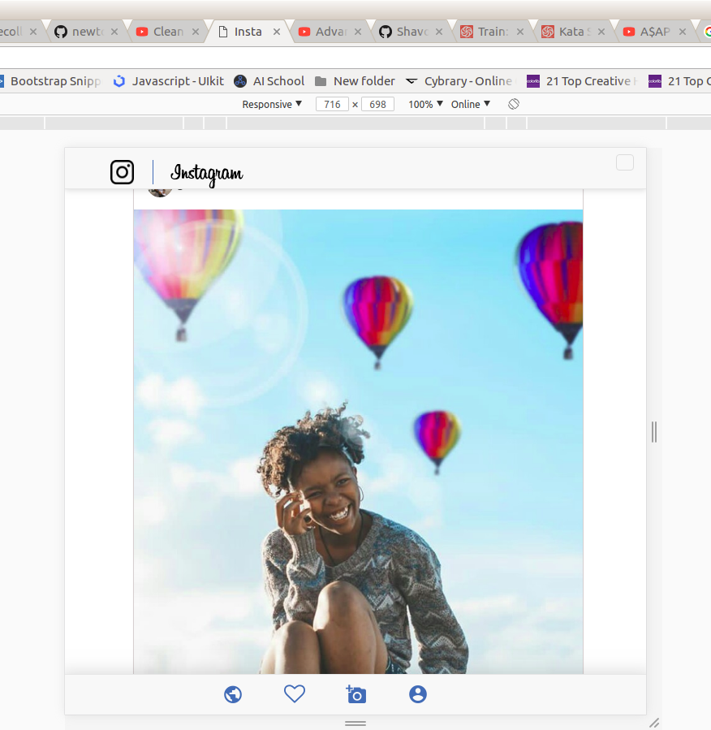
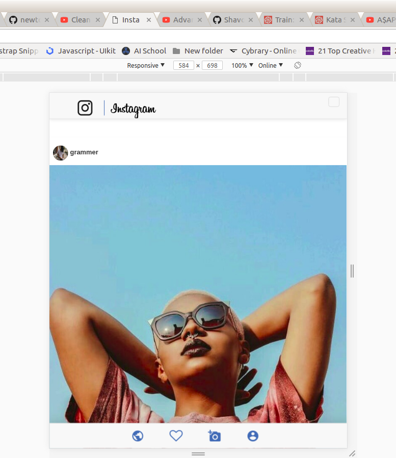
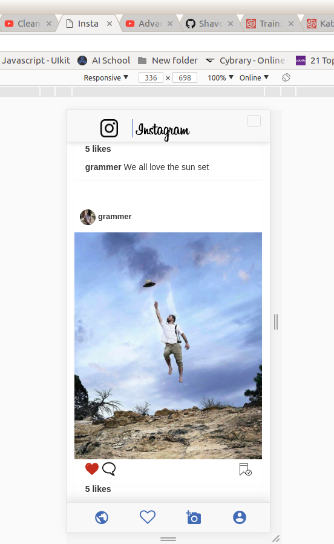

#                                                    INSTAGRAM.

#                                                  WEBSITE DSPLAY.
# Website Layout

## This is to Show the page is responsive and to also show the layout design

## - Full Screen layout

## - Mid Size Full Screen layout

## - Mid Size Screen

## - Phone Screen Layout
##     Large Phone Screen

## - Small Phone Screen

#  PROJECT DESCRIPTION

## In plain simple terms this is an Instagram-clone A photo application that you Display your photos for others to see.

## Author
Collins Kariuki

## Prerequisites
-You need to have nano text editor installed. you can find out whether you have it installed by typing nano --version in your terminal. For most linux distributions, it is installed by default. However, if you don't have it installed, you can quicky do that by typing sudo apt-get install nano in your terminal.

-You need to have (python3.6) installed in your machine

# Setup/Installation Requirements

-Internet connection

-webpage URL:

-To get to this webpage fist you need to get to my github repository

-The link to my github Repository is: https://github.com/zecollokaris

-from there you can access the work

-git clone project link

-install dependancies in requirements.txt file

-cd into project

-source virtual/bin/activate

-Run The Project-: (python manage.py runserver)

#{follow the above instructions for set up}

#Technologies Used

-HTML5
-CSS
-Bootstarap
-Python3.6
-Django

#Contact

-Mobile number: (254) 798731203
-Email Address: collo.kariss@gmail.com
-github: zecollokaris

Collins Kariuki - MIT (c)2018 LICENSE